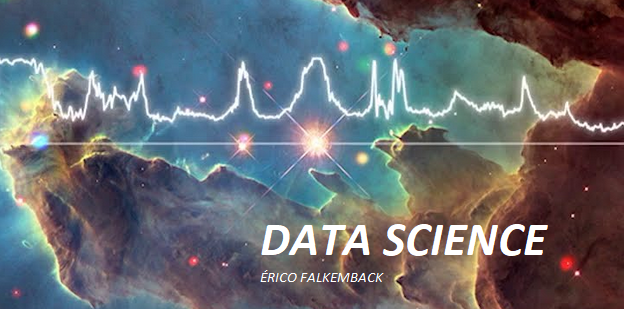

   

  

# Érico Falkemback Estudigio
*Lead Data Scientist*

 Mechanical Engineer;
- 12 years' experience in the management and implementation of the ISO 9001 standard, carrying out improvement projects for process and management efficiency;
- Experience in metrology, destructive and non-destructive testing, machining, boilermaking and welding. In order to carry out the work correctly and efficiently, I took courses in several areas that converge to improve the organization's processes such as Quality Analyst, Internal Auditor of SAE AS 9100D - version 2016 and NBR ISO 9001: 2000/2015, Interpretation of Geometric Tolerances (GD&T) and Mechanical Technical Design, Metrology and Three-dimensional Inspection, Ultrasound Test N1, among others;
- I have experience with all courses taken. I am focused, proactive, teamwork and friendly;

**Background in:** Python, Machine Learning, R.

**Links:**

* [LinkedIn](https://www.linkedin.com/in/%C3%A9rico-falkemback-1bab2498/)
* [Medium](https://medium.com/@erico.inspecao)

## Projetos:
Veja os tutoriais publicados do Sigmoidal:

* **Como usar o Histograma para Data Science:** https://bit.ly/2L2cMwy
* **Como Implementar Regressão Linear com Python:** https://bit.ly/2Li5pzY
* **Data Science: Investigando o naufrágio do Titanic:** https://bit.ly/2Ubr5SH
* **Como Tratar Dados Ausentes com Pandas:** https://bit.ly/31KWSMN
* **XGBoost: aprenda este algoritmo de Machine Learning em Python:** https://bit.ly/2UbRhws
* **Como criar uma Wordcloud em Python:** https://bit.ly/2OxsphM
* **Como lidar com dados desbalanceados:** https://bit.ly/2ZlaNsV

---

